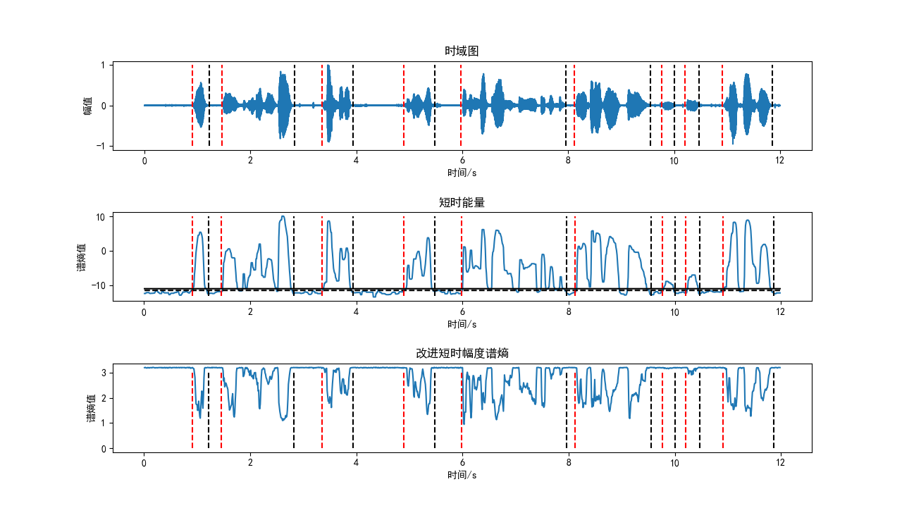

# VAD
## 内容及结论
&emsp;&emsp;主要采用的VAD检测方法是根据短时能量进行双门限端点检测。
&emsp;&emsp;通过查询资料以及相关代码，首先发现对幅度谱熵进行改善，有利于进行端点检测，但是通过实验发现其端点检测会切到音头和音尾的部分，并且针对小能量的音频无法准确检测；其次过零率具有较大的波动，尤其是在添加噪声的情况下其门限不容易确定；最终选择对短时能量进行检测，通过平滑滤波后的短时能量会保留音头和音尾的部分，并且其可以检测出小能量的音频。
&emsp;&emsp;本实验并没有严格按照双门限的VAD，而是对短时幅度能量谱设置双门限，$Speech > M_H$代表进入语音段,$M_L<Speech<M_H$代表可能处于语音段，$Speech<M_H$代表静音状态。仅通过对平滑滤波后的短时能量进行双阈值检测就可以准确地检测出来。
## 依赖库
```py
from SSP.vad import*
from SSP.preprocess import *
from SSP.sspplot import *
numpy
pandas
matplotlib
scipy
```
&emsp;&emsp;SSP是包含了作业1和作业2的所有自定义函数，此次作业主要函数在vad.py里进行定义，在后文会展示出来。
## 主函数
### 设置一些基本参数
```py
IS = 0.25                                   # 前导无话段长度
frame_len_s = 0.025                         # 帧长 25ms /200
frame_shift_s = 0.01                        # 帧移 10ms /80
SNR = 10                                    # 信噪比
eps = np.finfo(float).eps                   # 小值
```
### 预处理
```py
fs, sig = readAudio('./PHONE_001.wav')   
sig_ = sig - np.mean(sig)                    # 消除直流分量
x = sig_/np.max(np.abs(sig_))                # 幅值归一化
signal ,_ = Gnoisegen(x,SNR)                 # 将信号添加高斯噪声
```
读入音频，并添加高斯噪声

### 分帧 加窗
```py
window = Window(frame_len_s,fs,'hamming')             # 窗函数
frame_sig = enframe(signal,frame_len_s,frame_shift_s) # 分帧
frame_sig_win = (frame_sig*window).T                  # 加窗
frame_num = frame_sig_win.shape[1]                    # 帧数
km = int (np.floor(frame_len_s*fs/8))                 # 子带个数 200/8 = 25 
K = 0.5
```

### 计算短时能量
```py
En = []
for i in range(frame_num):
    En.append(10*np.log10(sum(frame_sig_win[:,i] * frame_sig_win[:,i])))
```
公式：
$$ dB = 10\log_{10}\sum_{i=1}^{N}|x[i]|^2$$

### 计算过零率
```py
'''
浊音的过零率:低
清音的过零率:高
'''
zcr = np.zeros((1,frame_num))
zcr = zcr.reshape(zcr.size)
for i in range(frame_num):
    z = frame_sig_win[:,i]
    for j in range(int(frame_len_s*fs)-1):
        if z[j]*z[j+1]<0:
            zcr[i] = zcr[i]+1
```

### 计算短时幅度谱熵
```py
df = 1/frame_len_s                           # 谱分辨率 == 40 1个点代表40Hz
fx1 = int(np.fix(250/df)+1);                 # 250Hz，3500Hz的位置
fx2 = int(np.fix(3500/df)+1);                # 
km = int (np.floor(frame_len_s*fs/8))        # 子带个数 200/8 = 25 
K = 0.5                                      # 常熟K
Eb = []
Hb = []

for i in range(frame_num):
    A = np.abs(np.fft.rfft(frame_sig_win[:,i]))       # 取来一帧数据FFT后取幅值 RFFT
    E = A[fx1+1:fx2-1]**2                             # 只取250~3500Hz之间的分量 计算能量 
    for m in range(km):
        Eb.append(np.sum(E[4*m-3:4*m]))
    Eb = np.array(Eb)
    prob = (Eb+K)/np.sum(Eb+K)
    Hb.append(-np.sum(prob*np.log(prob+eps)))
    Eb = []
```

### VAD检测
```py
Me = np.min(En)
T1 = 0.9*Me
T2 = T1+0.6

voiceseg,vsl,SF,NF =  VAD_E(En,T1,T2)  # 采用短时能量的VAD检测
voiceseg = spliting(voiceseg)          # 将音频静音间隔小的进行拼接
print('length(voiceseg):',len(voiceseg))
```
&emsp;&emsp;计算逻辑为:
**(1)** 取一帧做FFT，并计算谱能量，只计算250Hz~3500Hz
**(2)** 然后对子带能量进行求和并计算能量密度，可以使熵值更加平滑稳定。
**(3)** 计算熵

&emsp;&emsp;采用短时改进子带谱熵的双阈值检测时发现，无法检测出一些小能量的音频，如图所示在第10s位置，因此将短时改进子带熵改成短时能量。
.png)

采用短时能量VAD检测如下图所示


### 绘图
```py
time = np.linspace(0,len(x),len(x))/fs                 # 时间刻度
frameTime = frame2Time(frame_num,frame_len_s,frame_shift_s)
line1 = np.linspace(T1,T1,len(frameTime))
line2 = np.linspace(T2,T2,len(frameTime))

plt.rcParams['font.sans-serif']=['SimHei']
plt.rcParams['axes.unicode_minus']=False
plt.subplot(3,1,1)
plt.plot(time,x)
plt.title('时域图')
plt.xlabel('时间/s')
plt.ylabel('幅值')

plt.subplot(3,1,2)
plt.plot(frameTime,En)
plt.plot(frameTime,line1,'k--')
plt.plot(frameTime,line2,'k-')
plt.title('短时能量')
plt.xlabel('时间/s')
plt.ylabel('谱熵值')

plt.subplot(3,1,3)
plt.plot(frameTime,Hb)
plt.title('改进短时幅度谱熵')
plt.xlabel('时间/s')
plt.ylabel('谱熵值')

plt.subplots_adjust(hspace=0.7)


'''--------------绘制直线图--------------'''

begin = np.ones((1,len(voiceseg)))
begin = list(begin.reshape(begin.size))

end = np.ones((1,len(voiceseg)))
end = list(end.reshape(end.size))

for i in range(len(voiceseg)):
    begin[i] = voiceseg[i]['begin']
    end[i] = voiceseg[i]['end']


x1 , y1 = axvline(begin,[-int(max(x)),int(max(x))])
x2 , y2 = axvline(end,[-int(max(x)),int(max(x))])

Hbx1,Hby1 = axvline(begin,[int(min(Hb)),int(max(Hb))])
Hbx2,Hby2 = axvline(end,[int(min(Hb)),int(max(Hb))])

Enx1,Eny1 = axvline(begin,[int(min(En)),int(max(En))])
Enx2,Eny2 = axvline(end,[int(min(En)),int(max(En))])

zcrx1,zcry1 = axvline(begin,[int(min(zcr)),int(max(zcr))])
zcrx2,zcry2 = axvline(end,[int(min(zcr)),int(max(zcr))])

for i in range(len(x1)):
    plt.subplot(3,1,1)
    plt.plot(x1[i] * frame_shift_s , y1 ,'r--')
    plt.plot(x2[i] * frame_shift_s , y2 ,'k--')
    
    plt.subplot(3,1,2)
    plt.plot(Enx1[i] * frame_shift_s , Eny1 ,'r--')
    plt.plot(Enx2[i] * frame_shift_s , Eny2 ,'k--')
    
    plt.subplot(3,1,3)
    plt.plot(Hbx1[i] * frame_shift_s , Hby1 ,'r--')
    plt.plot(Hbx2[i] * frame_shift_s , Hby2 ,'k--')

plt.show()
```

### 写入音频
```py
writeAudio('hw2/audio',sig,fs,voiceseg,frame_shift_s=0.01,frame_len_s=0.025)
```

## 自定义函数_vad.py
```py
import numpy as np
from   scipy.signal import medfilt 
import pandas as pd
def Gnoisegen(signal,SNR):
    '''
    叠加高斯白噪声到语音信号x中
    
    return
    ----------
    `y`
    `noise`
    '''
    noise = np.random.randn(*signal.shape)
    noise = noise-np.mean(noise)
    signal_power = (1/signal.shape[0])*np.sum(np.power(signal,2))
    noise_variance = signal_power/np.power(10,(SNR/10))
    noise = (np.sqrt(noise_variance)/np.std(noise))*noise
    y = signal + noise
    return y ,noise

def frame2Time(frameNum, frame_len_s = 0.025,frame_shift_s = 0.01):
    '''
    帧数转换为时间坐标
    '''
    frame_Time = np.linspace(0,frameNum-1,frameNum)*frame_shift_s+frame_len_s/2
    return frame_Time

def multimidfilter(x, m):
    '''
    平滑滤波
    '''
    a = x 
    for _ in range(m):
        b = medfilt(a,5)
        a = b
    y = b
    return y 

def find(*args):
    '''
    找列表中的满足表达式的元素下标
    >>> A = [1, 0, 0, 0, 1, 1]
    >>> find(A,'>',0)
        [0, 4, 5]
    '''
    if type(args[0])!= list:        # 如果不是列表就强制类型转换
        args[0] = list(args[0])
        print(type(args[0])," is already converted to list!")
    if len(args)!=3:
        return print('length of parameter is 3!')
    
    '''-----------------------------'''
    result = []
    if args[1]=='>':
        for index,i in enumerate( args[0]):
            if i>args[2]:
                result.append(index)
        return result
    if args[1]=='<':
        for index,i in enumerate( args[0]):
            if i<args[2]:
                result.append(index)
        return result
    if args[1]=='>=':
        for index,i in enumerate( args[0]):
            if i>=args[2]:
                result.append(index)
        return result
    if args[1]=='<=':
        for index,i in enumerate( args[0]):
            if i<=args[2]:
                result.append(index)
        return result
    if args[1]=='=' or args[1]=='==' :
        for index,i in enumerate( args[0]):
            if i==args[2]:
                result.append(index)
        return result
    if args[1]=='!=':
        for index,i in enumerate( args[0]):
            if i!=args[2]:
                result.append(index)
        return result
    
def findSegment(express):
    '''
    Example
    -------------------
    找音频的起点，终点，持续时间
    >>> express = # 0...1... 序列，0表示无音频，1表示有音频
    >>> findSegment(express)
    >>> return soundSegment
    [{'begin': 91, 'end': 120, 'duration': 29}, 
    {'begin': 147, 'end': 182, 'duration': 35}, 
    {'begin': 184, 'end': 282, 'duration': 98}, 
    {'begin': 336, 'end': 395, 'duration': 59}, 
    {'begin': 491, 'end': 550, 'duration': 59}, 
    {'begin': 598, 'end': 702, 'duration': 104}, 
    {'begin': 705, 'end': 796, 'duration': 91}, 
    {'begin': 812, 'end': 902, 'duration': 90}, 
    {'begin': 910, 'end': 952, 'duration': 42}]

    '''
    if express[0]==0:
        voiceIndex = find(express,'>',0)
    else:
        voiceIndex = express
    soundSegment = []
    soundSegment.append({'begin':1,'end':1,'duration':1})
    k = 0
    soundSegment[k]['begin'] = voiceIndex[0]
    for i in range(len(voiceIndex)-1):
        if voiceIndex[i+1] - voiceIndex[i]>1:
            soundSegment.append({'begin':1,'end':1,'duration':1})
            # print("更新前：",soundSegment)
            soundSegment[k]['end'] = voiceIndex[i]
            soundSegment[k+1]['begin'] = voiceIndex[i+1]
            # print("更新后：",soundSegment)
            k = k+1

    soundSegment[k]['end'] = voiceIndex[len(voiceIndex)-1] # 取最后一个值

    for i in range(k+1):
        soundSegment[i]['duration'] = soundSegment[i]['end']-soundSegment[i]['begin']
    
    return soundSegment

def VAD_H(dst1, T1 ,T2):
    '''
    VAD
    ----------
    对子带谱熵进行语音端点检测
    
    Parameters
    ---------
    #### input:
    `dst1`:     短时谱熵
    `T1`:       阈值1
    `T2`:       阈值2
    #### return
    
    
    '''
    fn = len(dst1)                           # 帧数

    maxsilence = 8
    minlen     = 5
    status     = 0
    
    count   = [0]
    silence = [0]
    x1 = [0]
    x2 = [0]
    
    # 开始端点检测
    xn = 0
    for n in range(fn):
        if status==1 or status ==0:
            if dst1[n] < T2:
                # print('State=1,进入语音段')
                x1[xn] = max([n - count[xn]-1,1])
                status = 2
                silence[xn] = 0
                count[xn] = count[xn]+1
            elif dst1[n] < T1:
                # print('State=1,可能处于语音段')
                status = 1
                count[xn] = count[xn]+1
            else:
                # print('State=1,静音状态')
                status = 0
                count[xn] = 0
                x1[xn] = 0
                x2[xn] = 0
        
        if status == 2:
            if dst1[n] < T1:
                # print('State=2,保持在语音段')
                count[xn] = count[xn]+1
                silence[xn] = 0
            else:
                # print('State=2,语音将结束!')
                silence[xn] = silence[xn] + 1
                if silence[xn] < maxsilence:
                    count[xn] = count[xn] + 1
                elif count[xn] < minlen:
                    status = 0
                    silence[xn] = 0
                    count[xn] = 0
                else:
                    # print('进入State3 语音结束')
                    status = 3
                    x2[xn] = x1[xn] + count[xn]
        if status == 3:
            # print('State=3,语音结束！')
            status = 0
            xn = xn +1
            count.append(0)
            silence.append(0)
            x1.append(0)
            x2.append(0)
            
    while x1.count(0):
        x1.remove(0)
    el = len(x1)
    
    x2 = x2[0:el]
    
    if x1[el-1] == 0:
        el = el - 1
    if el==0:
        return
    if x2[el-1]==0:
        x2[el-1] = fn
    # print('x1 = ',x1)
    # print('x2 = ',x2)   
    
    SF = np.zeros((1,fn))
    SF = SF.reshape(SF.size)
    NF = np.ones((1,fn))
    NF = NF.reshape(NF.size)

    for i in range(el):
        zero = np.zeros((1,int(x2[i])-int(x1[i])))
        one  = np.ones((1,int(x2[i])-int(x1[i])))
        zero = zero.reshape(zero.size)
        one  = one.reshape(one.size)
        SF[int(x1[i]):int(x2[i])] = one
        NF[int(x1[i]):int(x2[i])] = zero
    SF = list(SF)
    
    speechIndex = find(SF,'=',1)
    voiceseg = findSegment(speechIndex)
    vs1= len(voiceseg)
    return voiceseg,vs1,SF,NF

def VAD_E(dst1, T1 ,T2):
    '''
    VAD_E
    ----------
    对短时能量进行双门限语音端点检测
    
    Parameters
    ---------
    #### input:
    `dst1`:     短时能量
    `T1`:       阈值1
    `T2`:       阈值2
    #### return
    
    '''
    fn = len(dst1)                           # 帧数

    maxsilence = 6
    minlen     = 5
    status     = 0
    
    count   = [0]
    silence = [0]
    x1 = [0]
    x2 = [0]
    
    # 开始端点检测
    xn = 0
    for n in range(fn):
        if status==1 or status ==0:
            if dst1[n] > T2:
                # print('State=1,进入语音段')
                x1[xn] = max([n - count[xn]-1,1])
                status = 2
                silence[xn] = 0
                count[xn] = count[xn]+1
            elif dst1[n] > T1:
                # print('State=1,可能处于语音段')
                status = 1
                count[xn] = count[xn]+1
            else:
                # print('State=1,静音状态')
                status = 0
                count[xn] = 0
                x1[xn] = 0
                x2[xn] = 0
        
        if status == 2:
            if dst1[n] > T1:
                # print('State=2,保持在语音段')
                count[xn] = count[xn]+1
                silence[xn] = 0
            else:
                # print('State=2,语音将结束!')
                silence[xn] = silence[xn] + 1
                if silence[xn] < maxsilence:
                    count[xn] = count[xn] + 1
                elif count[xn] < minlen:
                    status = 0
                    silence[xn] = 0
                    count[xn] = 0
                else:
                    # print('进入State3 语音结束')
                    status = 3
                    x2[xn] = x1[xn] + count[xn]
        if status == 3:
            # print('State=3,语音结束！')
            status = 0
            xn = xn +1
            count.append(0)
            silence.append(0)
            x1.append(0)
            x2.append(0)
            
    while x1.count(0):
        x1.remove(0)
    el = len(x1)
    
    x2 = x2[0:el]
    
    if x1[el-1] == 0:
        el = el - 1
    if el==0:
        return
    if x2[el-1]==0:
        x2[el-1] = fn
    # print('x1 = ',x1)
    # print('x2 = ',x2)   
    
    SF = np.zeros((1,fn))
    SF = SF.reshape(SF.size)
    NF = np.ones((1,fn))
    NF = NF.reshape(NF.size)

    for i in range(el):
        zero = np.zeros((1,int(x2[i])-int(x1[i])))
        one  = np.ones((1,int(x2[i])-int(x1[i])))
        zero = zero.reshape(zero.size)
        one  = one.reshape(one.size)
        SF[int(x1[i]):int(x2[i])] = one
        NF[int(x1[i]):int(x2[i])] = zero
    SF = list(SF)
    
    speechIndex = find(SF,'=',1)
    voiceseg = findSegment(speechIndex)
    vs1= len(voiceseg)
    return voiceseg,vs1,SF,NF


def spliting(voiceseg):
    '''
    拼接函数
    -----------------------------
    将duration低于 20ms / 20帧 的一段去除默认为噪声干扰去除
    将两段音频间隔低于 10ms / 10帧 的两端拼接在一块
    '''    
    label = pd.DataFrame(voiceseg)
    # print('调整前：',label)       
    
    for i in range(len(voiceseg)):             
        if voiceseg[i]['duration'] < 20:   # 去掉间隔低于20ms 20/帧 
            voiceseg[i]['begin'] = 0
            voiceseg[i]['duration'] = 0
            voiceseg[i]['end'] = 0

    label = pd.DataFrame(voiceseg)
    new_label = label[(label.T!=0).any()]            # 去掉行全0的值
    new_label = new_label.reset_index(drop=True)
    voiceseg = new_label.to_dict(orient='records')  # 转换为records形式
    
    for i in range(1,len(voiceseg)):
        if voiceseg[i]['begin']-voiceseg[i-1]['end'] <11 and voiceseg[i-1]['end']!=0:
            voiceseg[i]['begin'] = voiceseg[i-1]['begin']
            voiceseg[i]['duration'] = voiceseg[i]['end']-voiceseg[i]['begin']
            voiceseg[i-1]['begin'] = 0
            voiceseg[i-1]['duration'] = 0
            voiceseg[i-1]['end'] = 0


    label = pd.DataFrame(voiceseg)
    new_label = label[(label.T!=0).any()]            # 去掉行全0的值
    new_label = new_label.reset_index(drop=True)
    # print("调整后：",new_label)
    new_label = new_label.to_dict(orient='records')  # 转换为records形式
    '''
    即:输入的原始模式
     [{'begin': 91, 'end': 120, 'duration': 29}, 
     {'begin': 147, 'end': 183, 'duration': 36}, 
     {'begin': 335, 'end': 394, 'duration': 59}, 
     {'begin': 490, 'end': 548, 'duration': 58}, 
     {'begin': 599, 'end': 777, 'duration': 178}, 
     {'begin': 813, 'end': 903, 'duration': 90}]
    '''
    return new_label
```